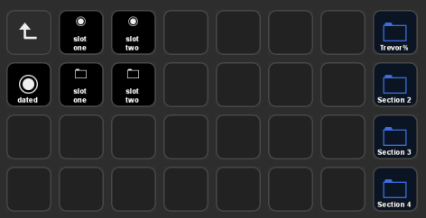

# GTA V Helper Programs

This contains helper programs for manage GTA V.

I used it primarily with my Stream Deck to allow me to manage save files through the click of a single button:



## gtav-saveload

GTA V Save/Load manager that can be used on the commandline.

#### Examples

All slots are stored in: `%USERPROFILE%/Documents/Rockstar Games/GTA V/Profiles/{profile}/Slots`.

Save the current files into a slot `foo`:

```
gtav-saveload --save foo
```

Load files from the slot `foo`:

```
gtav-saveload --load foo
```

Load files from `%USERPROFILE%/Documents/Rockstar Games/GTA V/Profiles/{profile}/Save Files`.
Will match the first directory named something with `Chop`.

```
gtav-saveload --load-save-file "Chop"
```

Take the current save files, and save into a dated slot:

```
gtav-saveload --save-dated
```